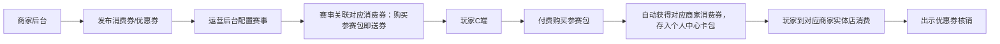

# 铁甲快狗核心商业闭环需求
更新时间：2026-06-27
## 一、核心商业目标
1. C端增收：通过商家消费券激励玩家购买参赛包，提升C端付费转化率与ARPU值
2. B端引流：玩家领取消费券后引流到商家实体店消费，提升B端商家合作意愿，为后续B端广告/发券收费奠定基础
## 二、核心业务流程（全链路闭环）

## 三、测试优先级
🔴 **P0级必测，100%覆盖，不通过禁止上线**
## 四、验收标准
1. 商家后台可正常创建、发布不同面额/使用规则的消费券
2. 运营后台可正常将消费券关联到对应赛事，配置买参赛包送券规则
3. 玩家购买参赛包后，卡包内自动到账对应消费券，券信息（面额、有效期、使用商家、使用规则）展示正确
4. 消费券状态流转正常：未使用 → 已使用 → 已过期
5. 商家端可正常核销用户出示的消费券，核销后状态同步更新
6. 核销数据可在运营后台统计查询